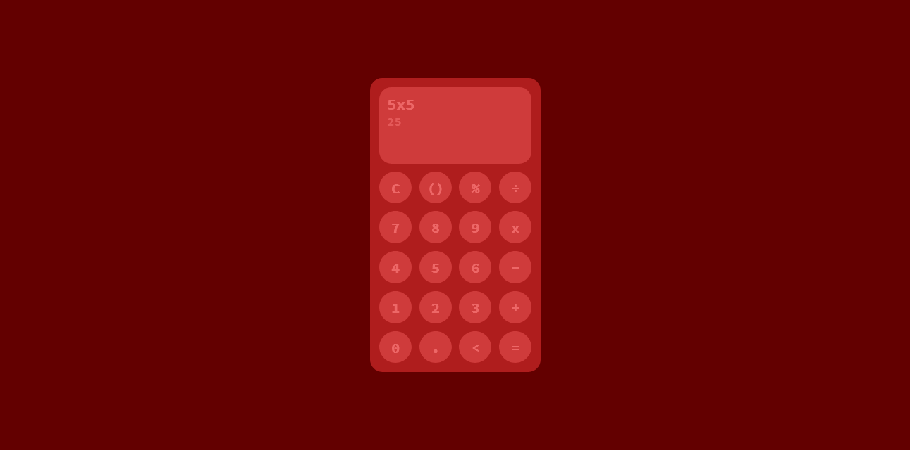
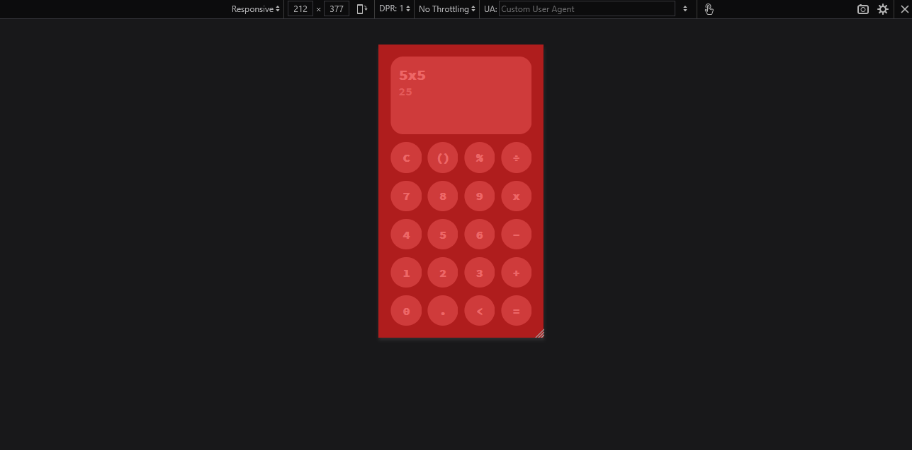

## Запуск
- Установка зависимостей - ```npm install```
- Запуск проекта - ```npm start```

---

## Ошибки
- Калькулятор пропускает некоторые запрещённые нажатия, но большинство ошибок было закрыто.
- Не стал закрывать все, в связи с тем, что это забирает очень много времени.

# Предварительный просмотр
- Вид с десктопа
---

- Вид с телефона (<300px)
---

- Вид с телефона (большинство размеров)
---

